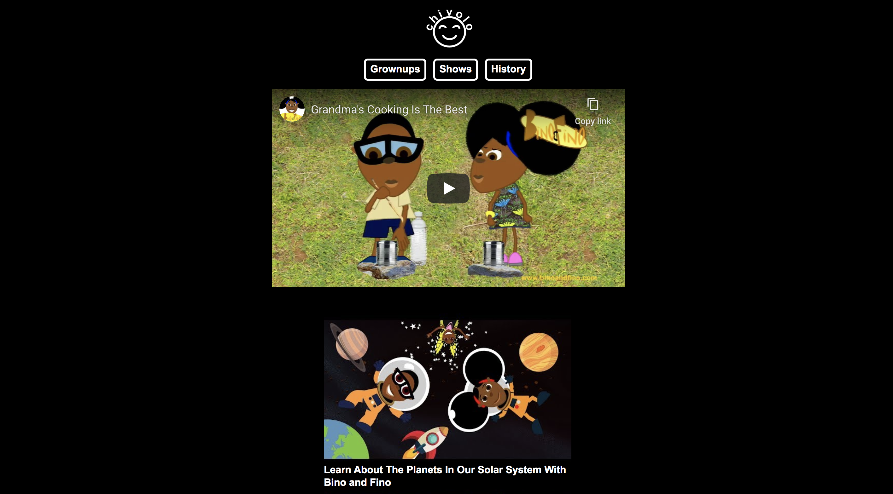
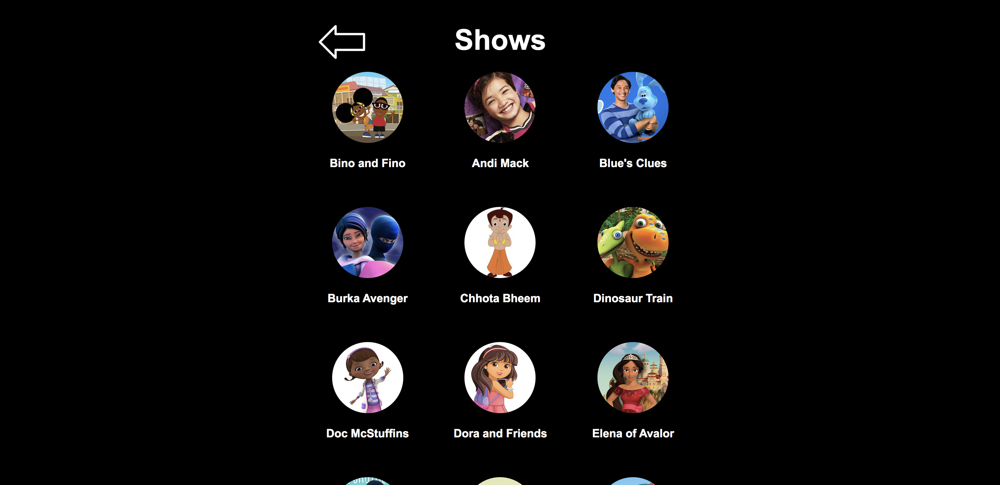
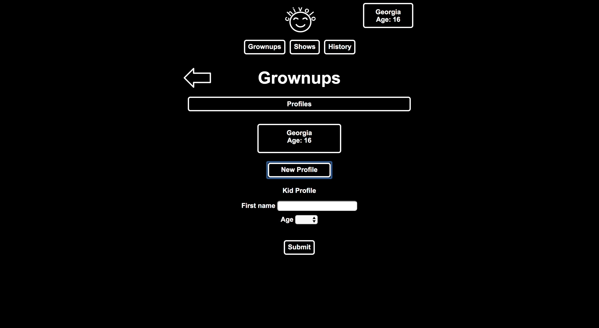
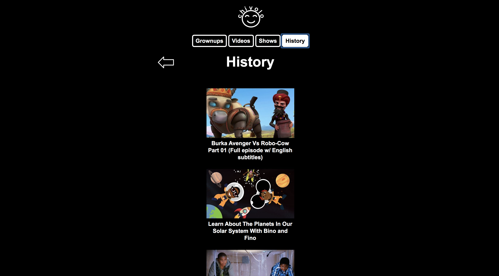

# Chivolo

Chivolo is a kids' video app that features shows with racially-diverse main characters.

## Live App

https://georgiakirkpatrick.github.io/chivolo/

## Motivation

When Chivolo's creator, Georgia Kirkpatrick, reviewed her four-year-old stepdaughter's viewing history on the YouTube Kids app, she found that very few videos featured characters of color.  Georgia created Chivolo with content from the YouTube Data API to provide families with kids' videos that reflect the diversity of the real world, helping children form positive associations with people of all races.

## Summary

The main page of the app displays a video player, video options, and show playlist options.  The landing page relies on an abundance of images to make the app useable for pre-readers.  The video player has familiar YouTube buttons and can be maximized to full-screen.  Kids select videos to play in the video player by tapping the video options.  Kids choose videos with their favorite characters by clicking the show icons near the bottom of the main page.  Content is fetched from the YouTube Data API on load and new content is added by YouTube playlist owners.  Parents have the option to filter shows based on their child's age by tapping the "Grownups" button and creating a profile for one or more children.  The "History" button lists all the videos that have been played on the app so kids can replay videos they enjoyed while parents can review the content their child has viewed.

Main Page / Landing Page:

Shows Section (bottom of main page):

Video Maximized:

Grownups Page:

History Page:

## Built With

HTML, CSS, JavaScript, JQuery, and the YouTube Data API

## Acknowledgements

Chivolo's video content was selected by Georgia Kirkpatrick who was grateful for the following helpful resources:

[Diversity in Cartoons: Kid’s Shows by Lily Berry](https://medium.com/cartoons-and-diversity-2019/diversity-in-cartoons-kids-shows-1f21ab44dd06)

[TV Shows with Diverse Characters by Common Sense Media](https://www.commonsensemedia.org/lists/tv-shows-with-diverse-characters)

[6 Diverse Children's Cartoons (Where the Main Character Isn't Necessarily White) by Stephanie Meade](https://www.huffpost.com/entry/6-diverse-childrens-cartoons_b_4060367?guccounter=1&guce_referrer=aHR0cHM6Ly93d3cuZ29vZ2xlLmNvbS8&guce_referrer_sig=AQAAAJmWWFjEaI2bpknNLwfhRJMZmMdfFwr7Nnr9mqrUUk7mHMOaYsQD4zf_U0a69K-0PSelNAneGvyfbLBdrh9dBw5qfRxTVeiL4TLTujUl9KS62LamjPftbTd3613ICr392vw6yn4H5TKSLUZ5bC2GzR33bl4dLZ4F_-k5Q4ceaANq)

[Kids' TV lacks gender balance and diversity, new study suggests by Jessica Wong](https://www.cbc.ca/news/entertainment/childrens-tv-study-diversity-1.5118385)
